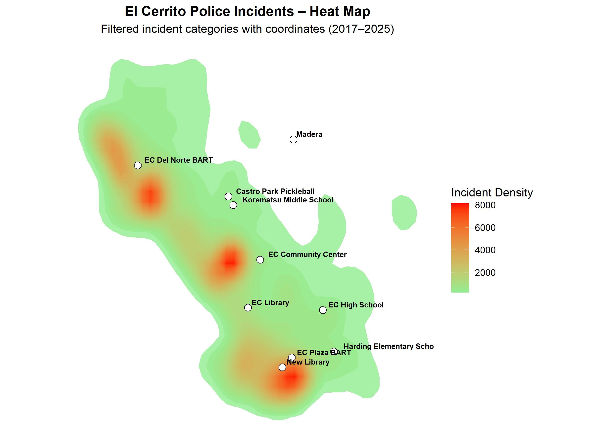

I’ve completed a detailed analysis of police incident patterns in El Cerrito using data from 2019 through March 2025.  
The report examines counts by type, geography, and time, with heat maps showing where incidents are most concentrated.

A key finding is the **high concentration along San Pablo Avenue**, including the proposed library site. Seasonal variation is modest, and incidents dipped during 2020–2022.

---

### Citywide Incident Heatmap
*Darker areas indicate higher concentrations of incidents.*

---

📄 **Full Report:**  
[Download the Word document](el_cerrito_police_github_long.docx)

📧 **Contact:** irasharenow100@gmail.com
